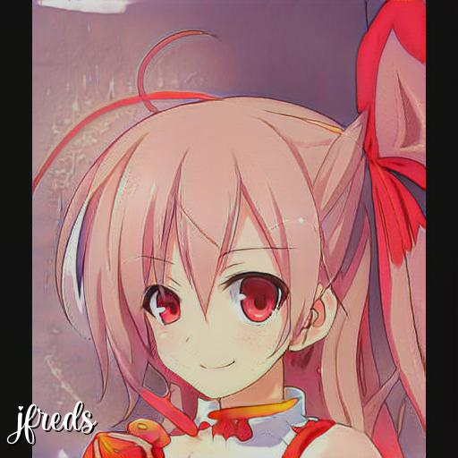

# Waifu_Bot
Jesse Fredrickson
11/3/2020

## Purpose
This repo contains the code to operate simple a discord bot which, when prompted with a "claim waifu" message in chat, will dynamically generate and post a unique anime girlfriend. Who wouldn't want that

## Usage
It is assumed the user already has python3. A basic understanding of python is useful but not necessary.

**Python Environment**
- Clone this repository `git clone https://github.com/jfreds91/waifu_bot`
- Navigate to cloned repo and create a new virtual environment `python3 -m venv env`
- Activate environment `source env/bin/activate`
- Update environment from requirements doc `pip install -r requirements.txt`

**System Installs**
- At this point you already have the onnx runtime package(s) installed, but you may have to install additional dependencies, see below. On MacOS, I had to install OpenMP `brew install libomp`
- Follow the install instructions at https://github.com/Microsoft/onnxruntime

**GAN Model download**
- Download the TWDNE3.onnx model from https://hivemind-repo.s3-us-west-2.amazonaws.com/twdne3/twdne3.onnx and move it to your project repo
- If that's no longer active, look for an update on https://www.gwern.net/Faces#

**Runtime**
- You will need to create your own discord bot token. [Instructions](https://www.writebots.com/discord-bot-token/)
- You will need to create your own *credentials.cfg* file containing the token to be read in by [configparser](https://docs.python.org/3/library/configparser.html)
- You will need to edit the .onnx model filepaths. Currently hardcoded in *discord_client.py*
- You may adjust the "artistic liberty" of the generator by changing the TRUNCATION scalar from 0 (no liberty, converged to single average waifu) to any float. Gwern defaults to 0.7 for his work; anything over 1.2 or so results in Lovecraftian horror

## Motivation
The application is fun, but I wrote this project to explore a few interesting technical areas.
1. ONNX. [ONNX](https://onnx.ai) is a common model interoperability platform introduced by Facebook and Microsoft in 2017, and allows for users to run framework-agnostic models by converting to its own common format. This repo uses an onnx model and onnx runtime to perform inference and generate images.
2. Discord API. I have a small but active discord which has helped me get through quarantine (COVID19), and improving it (for a loose definition of improve) is intriguing
3. GANs. Though I did not train this model myself, learning how to (ab)use the generator model was a learning experience, and Gwern's blog was a fascinating read.

Thanks for reading, enjoy!

## Docker Help
Pull Image: `docker pull jfreds/waifu_docker_test:latest`
Build Image from source: `docker build -t jfreds/waifu_docker_test:v0`
Open shell in container: `docker run --entrypoint "/bin/bash" -it jfreds/waifu_docker_test:v0`
Remove all stopped containers: `docker rm $(docker ps -a -q)`
Run waifu generation: docker run -v "$(pwd)":/mnt/here jfreds/waifu_docker_test:v0 python3.7 main.py -dir /mnt/here/ -t 1.25 -s Jesse
saved: /mnt/here/Jesse.jpeg
where -v is volume mount (allows container to save output to host storage)
where -dir is save location (should be mounted location)
where -t is truncation float; default is 0.7 (from git repo)
where -s is seed string for waifu. Allows spaces, quotes not needed.
